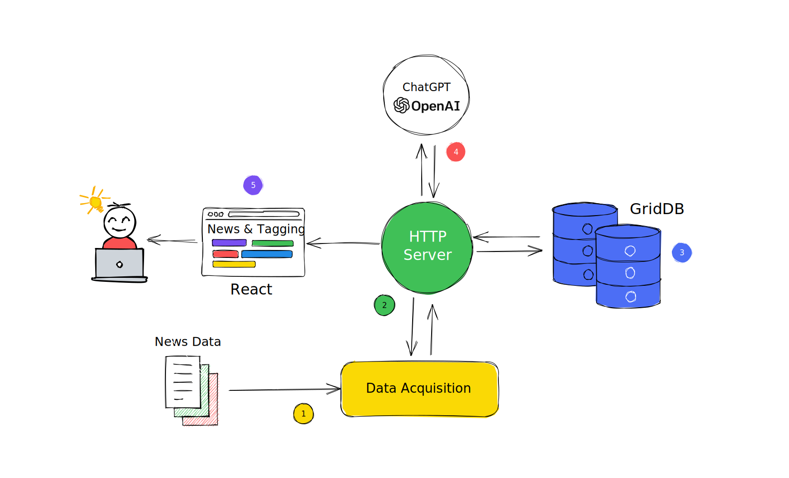
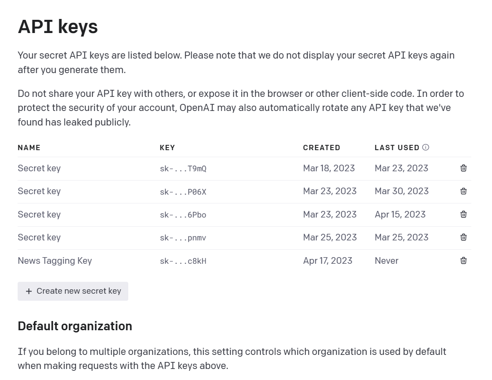
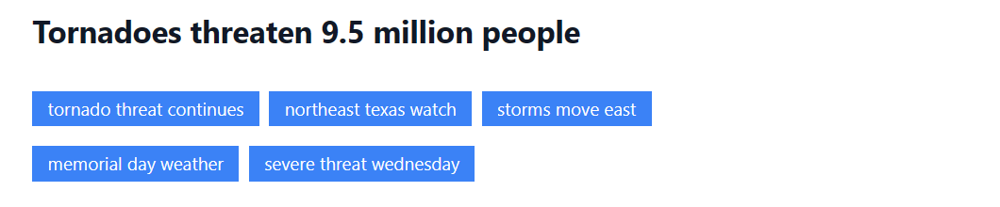

# How to Leverage ChatGPT, Node.js, and GridDB for Automated News Tagging

In today's fast-paced digital age, we are constantly bombarded with an immense volume of news articles across numerous platforms, ranging from social media to online news websites. This massive influx of information, often referred to as the "news flood," presents several challenges for both consumers and news organizations. Addressing these challenges, which include content organization, information overload, time-consuming manual tagging processes, and inefficient content discovery and recommendations, is essential for improving the user experience and the overall quality of news consumption.

One solution to the problem is to use news tagging. It plays a crucial role in processing, organizing, and presenting the wealth of information available in the digital news domain. Manually tagging countless news articles with accurate topics is an overwhelming and time-consuming task.

_What if there were an automated content tagging system that could efficiently process news articles in real time?_

In this blog post, we'll create an **automated news tagging system**. We'll delve into how the synergy of OpenAI, Node.js, and GridDB can create a powerful automated news tagging in the digital news landscape. We'll leverage Node.js to process news data, ChatGPT to analyze and extract tags from the news, and GridDB to store and retrieve the information. Ultimately, we'll present the news and the tags to users.

## Auto Content Tagging System Overview

ChatGPT, developed by OpenAI, is a cutting-edge language model that excels in understanding and generating human-like text. Node.js is a popular open-source runtime environment built on Chrome's V8 JavaScript engine, enabling developers to create scalable and efficient web applications. GridDB is a highly performant NoSQL database designed for handling time-series data and large-scale datasets, with features such as automatic data partitioning and high availability.



In the given flow diagram, the interaction between ChatGPT, Node.js, and GridDB is illustrated, showcasing the overall system workflow for multi-news data acquisition, processing, and content tagging. The diagram can be broken down into the following steps for a better understanding:

1. Data Acquisition: Node.js is employed to collect and acquire data from multiple news sources.

2. Data Processing: Once the data is obtained, Node.js is responsible for processing and filtering the relevant information, ensuring that it is in the desired format for further use.

3. Data Storage: After processing, the refined data is stored in GridDB, a high-performance, scalable NoSQL database, which provides efficient storage and retrieval of the data.

4. Content Tagging with ChatGPT: The processed data is then fed to ChatGPT, a state-of-the-art AI language model. ChatGPT analyzes the data and generates content tags based on the context and relevant keywords.

5. Presenting the Data to the User with React: After the data has been processed, stored, and tagged, it is important to present it in an accessible and user-friendly format. In this case, React, a popular JavaScript library for building user interfaces, is utilized to create a web-based application that displays news and tags.

In summary, the updated flow diagram represents a system that employs Node.js for data acquisition and processing, GridDB for data storage, ChatGPT for news tagging, and React for creating a user-friendly interface that presents the data to end-users, resulting in a comprehensive and efficient multi-news data handling solution.

## Full Project Installation Guide

The installation process for the project is straightforward. First, ensure that your operating system has Node.js 18 installed and verify that the GridDB database is operational. On Ubuntu 20.04, you can check GridDB using `systemctl`

```bash
sudo systemctl status gridstore
```

and Node.js with this command

```bash
node --version
```

If all is well, clone the project from the GitHub repository [news tagging](https://github.com/junwatu/news-analysis-chatgpt-nodejs-griddb-code)

```bash
git clone git@github.com:junwatu/news-analysis-chatgpt-nodejs-griddb-code.git
```
Next, install the project's dependencies

```bash
cd news-analysis-chatgpt-nodejs-griddb-code
npm install
```
Before running the project, it is crucial to have an OpenAI API key, as this is a primary requirement for this project. 

> You'll need to set up a paid account to use the API, but the cost is quite low at just $0.002 per 1,000 tokens. A rough estimate is that 1,000 tokens correspond to around 200 to 300 words in English, based on the average word length of 4-5 characters plus a space (totaling 5-6 characters per word).

To obtain the key, [sign up](https://platform.openai.com/account/api-keys) for an account at OpenAI and follow the instructions to get your API key. 



Once you have the key, edit the `.env` file on the `apps/server` directory

```ini
OPENAI_API_KEY=<your_api_key>
```

Replace <your_api_key> with your actual OpenAI API key. With the OpenAI API key set up, you can now proceed to run the project 

```bash
npx turbo start
```

Finally, access the web application by navigating to the URL `http://localhost:5137`


## Key Concepts and Practical Codes

### Using ChatGPT to Generate News Tags

ChatGPT is an advanced artificial intelligence language model based on the GPT (Generative Pre-trained Transformer) architecture. The model is designed to understand and generate human-like text based on the input it receives. It is capable of performing various tasks, including answering questions, engaging in conversation, and generating text in a range of styles and formats. ChatGPT has been widely used in various applications, such as chatbots, content generation, translation, and more.

As the core natural language processing component, ChatGPT is responsible for analyzing and generating tags from news articles.

#### Prompt

As ChatGPT is capable of natural language understanding, generating tags from a news article is ridiculously easy. All we have to do is ask for it!

A prompt is a text used to guide a language model or machine learning system to generate a relevant output. It can take many forms, such as questions, commands, or passages of text, and a well-designed prompt is crucial for the accuracy and relevance of the output.

To generate tags from a news article, we can provide a prompt to ChatGPT that specifies the desired output. For example, in JavaScript, the prompt could be structured like this:

```js
const prompt = `Generate five tags, less than 3 words, and give numbers for the tags from this news:\n\n${news}`;
```

If we apply that prompt directly to the [ChatGPT](https://chat.openai.com/chat) website for a specific `news` article we will get 5 tags.


#### Tags Generator Code

OpenAI provides [Chat API](https://platform.openai.com/docs/api-reference/chat) for users to access ChatGPT models. We will use the `gpt-3.5-turbo` model to generate tags from our news.

```js
import { Configuration, OpenAIApi } from "openai";

const configuration = new Configuration({
  apiKey: process.env.OPENAI_API_KEY,
});
const openai = new OpenAIApi(configuration);

async function generateTagsFromNews(news) {
  const prompt = `Generate five tags, less than 3 words, and give numbers for the tags from this news:\n\n${news}`;
  try {
    const completion = await openai.createChatCompletion({
      model: "gpt-3.5-turbo",
      max_tokens: 2000,
      messages: [{ role: "user", content: prompt }],
    });
    return completion.data.choices[0].message;
  } catch (error) {
    console.error("Error occurred while generating tags:", error);
    // Handle the error as needed, or return a suitable error message
    return "An error occurred while generating tags.";
  }
}

export { generateTagsFromNews };
```

The OpenAI API for the [Chat](https://platform.openai.com/docs/api-reference/chat) model utilizes the `createChatCompletion` function. By crafting the appropriate prompt, the model can generate outstanding completion responses.

It is essential to know that the `gpt-3.5-turbo` model has a `max_tokens` limit of 4096 tokens. If a prompt exceeds this limit, you will need to truncate, omit, or otherwise condense your text to ensure it fits within the model's maximum capacity.

### Data Acquisition with Node.js

Node.js serves as the backbone of the web application, allowing developers to build a fast, scalable, and reliable system for processing and managing news data. With its non-blocking, event-driven architecture and extensive package ecosystem, Node.js makes it easy to implement complex features, such as real-time data processing and API integration.

For an optimal data source, utilizing news API would be preferable. However, for this specific project, data can be obtained from the Hugging Face website at [huggingface.co](https://huggingface.co/datasets/multi_news).

> Hugging Face is a popular platform for natural language processing (NLP) models and datasets.

**Multi-News** is a dataset on Hugging Face that consists of news articles and human-written summaries of these articles from the site newser.com. Each summary is professionally written by editors.

With Node.js is easy to consume the dataset using the native `fetch` function

```js
async function fetchMultiNews() {
	const url = "https://datasets-server.huggingface.co/first-rows?dataset=multi_news&config=default&split=train";

	try {
		const response = await fetch(url);
		if (response.ok) {
			const data = await response.json();
			return data.rows
		} else {
			console.error('Error fetching dataset', response.statusText);
			return response.statusText;
		}
	} catch (error) {
		console.error('Error:', error);
		throw new Error(error);
	}
}

export { fetchMultiNews }
```

### Data Processing with Node.js

The main goal of the data processing is to prepare and format the news data and then store it in a container GridDB.

```js
const newsData = await fetchMultiNews();
logger.info(`News Data: ${newsData.length}`);

const cont = await store.putContainer(conInfo)
const query = await cont.query("SELECT *");
const rowset = await query.fetch();
const results = [];

while (rowset.hasNext()) {
	const row = rowset.next();
	const rowData = { id: `${row[0]}`, news: row[1] };
	results.push(rowData);
}

let newsDataSelected;

if (Array.isArray(results) && results.length == 0) {
	logger.info('Database Empty...initialized!');
	const newsDataObject = saveNewsData(newsData);
	newsDataSelected = await generateData(newsDataObject)
} else {
	const newsDataObject2 = formatData(newsData);
	newsDataSelected = await generateData(newsDataObject2);
}
```

The code above checks if the container in GridDB is empty and processes the fetched news data accordingly, either saving the new data or reading the existing data. If the container is empty, the `saveNewsData` function will store the news data.

The data processing function is a straightforward function that transforms a JavaScript object into an array format `[id, news]` suitable for the GridDB container.

```js
function saveNewsData(newsData) {
	const newsDataObject = {}
	const newsDataArray = []
	newsData.forEach((element, index) => {
		const news = element?.row?.document;
		newsDataObject[index + 1] = news;
		newsDataArray.push([index, news]);
	});

	saveForEach(newsDataArray); //⚠️
	return newsDataObject;
}
```

### Storing and Managing Data with GridDB

To store and manage vast amounts of news data, [GridDB](http://griddb.net/) comes into play as the data storage solution. Its high-performance capabilities, support for horizontal scaling, and time-series data handling make it an ideal choice for managing the large-scale datasets involved in news tagging. Moreover, GridDB's efficient querying and data retrieval features ensure that the application can quickly serve relevant content to users.

In the GridDB `MultiNews` container, there are two fields designed to store specific types of data, the identifier `id` and the news content `news`. The container is defined using the following JavaScript code:

```js
const conInfo = new griddb.ContainerInfo({
	'name': containerName,
	'columnInfoList': [
		["id", griddb.Type.INTEGER],
		["news", griddb.Type.STRING]],
	'type': griddb.ContainerType.COLLECTION, 'rowKey': true
});
```

The `insert` function in the given code snippet is used to save data to a GridDB container. It takes two arguments: `data` and `container`. The `data` argument is an array containing a collection of the news data while the `container` argument refers to the GridDB container instance where the data will be saved. Here's a breakdown of the function:

```js
function insert(data, container) {
	try {
		container.put(data);
		return { ok: true };
	} catch (err) {
		console.log(`insert: ${err}`);
		return { ok: false, error: err };
	}
}
```

The data should have the format `[id, news]` and to save it to the GridDB container we can use `put` function. 

### Node.js HTTP Server

HTTP Server is built with Node.js and Express.js, and features a primary route `/multinews`. This route will return the news `id`, `news` data, news `tags`, and news `title`. The returned data is in JSON format, which simplifies consumption. 

The server response JSON example:

```json
{
    "id": "18",
    "news": "VATICAN CITY (Reuters) - Pope Francis, ...",
    "tags": [
        "youth voices",
        "tighter gun laws",
        "palm sunday service",
        "young catholics",
        "church transparency"
    ],
    "title": "Pope Francis Urges Young People to Speak Up"
}
```

If you open the browser and hit directly to the URL `http://localhost:4000/multinews` you will get a JSON response!

### Presenting Data with a React Frontend

React is a widely-used JavaScript library for creating user interfaces, particularly in single-page applications. It is user-friendly, boasts a substantial community of developers, and offers excellent performance due to its efficient virtual DOM implementation.

For this project, there is only one component to display the news data. The `News` component is responsible for fetching and displaying news data from the Node.js HTTP server. By using `useState` and `useEffect` hooks it's easy to manage the component's state.

```js
import React, { useState, useEffect } from 'react';

const [randomNews, setRandomNews] = useState({});

useEffect(() => {
    fetchNews();
  }, []);

const fetchNews = async () => {
    console.log(SERVER_URL);
    try {
      const response = await fetch(SERVER_URL);
      const data = await response.json();
      setRandomNews(data);
	  setLoading(false);
    } catch (error) {
      console.error('Error fetching news:', error);
    }
  };
```

The `News` component will get the JSON data everytime the page is reload and re-rendering the user interface.

```html
<h2>{randomNews.title}</h2>
<ul className='px-0 left-0'>

{randomNews.tags.map((item, index) => (
	<li key={index} className='inline-block bg-blue-500 text-white text-sm px-3 py-1  mr-2 mb-2 rounded' title='generated tag'>
		{item}
	</li>
	))}
</ul>
<article className='text-left pb-5'>
  {showFullNews ? randomNews.news : `${randomNews.news.substring(0, 500)}...`}
</article>

```

Using React, JavaScript array `map` method, HTML `<ul>` and `<li>`, and CSS, it's easy to display the tags as blue badges. 



## Improvement and Suggestions
Here are some recommendations to enhance this project and suggestions for improvement:

- Keep in mind that this project is currently an MVP (Minimum Viable Product), which means there's ample room for improvement. For a real-world implementation, consider acquiring news data live and through real-time methods for a more accurate and up-to-date user experience.
- Introduce an admin dashboard for monitoring and managing OpenAI API usage. This feature would enable administrators to set restrictions, track usage, and maintain control over the application's functionality.
- To provide a more seamless and user-friendly experience, implement a paginated news display instead of the current system where random news articles appear upon each page reload. Pagination allows users to browse and navigate content more easily, resulting in a more engaging and enjoyable experience.

## Additional Resources and References

This section provides helpful resources and references for further understanding and exploration. Feel free to check out the following links:


- [Project source code on GitHub](https://github.com/junwatu/news-analysis-chatgpt-nodejs-griddb-code): Access the complete news tagging source code of the project.
- [OpenAI Chat API Guide](https://platform.openai.com/docs/guides/chat): Dive into the OpenAI Chat API documentation to understand how to interact with the ChatGPT model and other conversational AI models.
- [OpenAI Chat API Reference](https://platform.openai.com/docs/api-reference/chat): Access the detailed API reference for the OpenAI Chat API, covering parameters, response format, and more.
- [GridDB website](http://griddb.net/): Learn more about GridDB, the highly scalable and high-performance distributed database used in this project.
- [Node.js Linux installation](https://nodejs.org/en/download/package-manager#debian-and-ubuntu-based-linux-distributions): Follow the instructions to install Node.js on your Linux system.
- [ChatGPT](https://chat.openai.com/): Experiment with the ChatGPT model in a user-friendly interface, perfect for testing out conversational AI capabilities.
